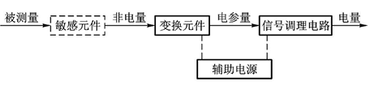
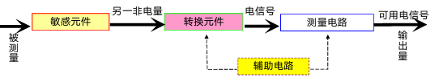
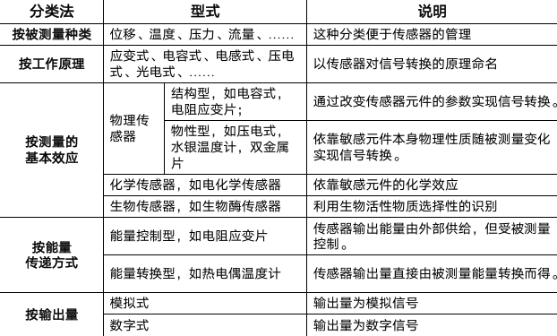
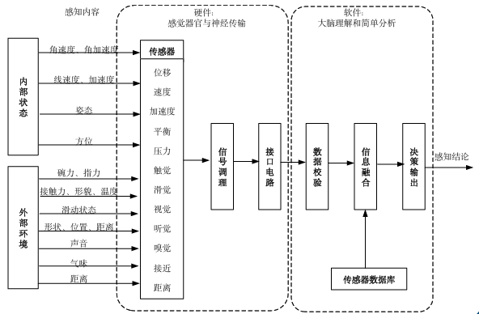

# 机器人概述

## 时间关键点

机械化 (十八世纪)、电气化 (二十世纪)、数字化 (现在)、智能化 (未来)

世界第一台真正意义上的机器人: Unimate 机器人 (1961 年)

## 机器人的内涵

熊有伦院士提出：操作臂、海陆空、人机共融

- 操作臂代表传统工业机器人
- 海陆空代表无人机、智能车和水下机器人
- 人机共融涵盖服务机器人、仿生/类生机器人、拟人机器人、康复医疗（上肢/下肢外骨骼）机器人

## 机器人系统

机器人的三部分

- 机械部分 (四肢)
  - 机身
  - 移动机构
  - 手臂
  - 末端执行器
  - 驱动和传动机构
- 感知部分 (五感)
  - 自身状态的感知
  - 外部环境的感知
- 控制部分 (大脑)
  - 控制原理
  - 控制运动形式

# 机器人感知系统

## 感知

感知即意识对内外界信息的觉察、感觉、
注意、知觉的一系列过程

### 感觉过程

感知系统能够检测到环境信息及内部状态所对应的物理量

### 知觉过程

构建环境与状态模型，了解正确的状态与所在环境信息

## 传感器

A sensor converts a physical signal into an electrical signal

我们所学的传感器是物理信号转成电信号的

### 传感器的组成

- 敏感元件：被测非电量转换为其他形式信号 (易于转换成电量的：形变)
- 变换 (转换) 元件：非电量转换成电量 (电阻、电感、电容)-阻抗
- 辅助元件：信号调节与转换

### 传感器的分类

- 按被测量分类
  - 机械量：位移、力、速度、加速度…
  - 热工量：温度、流量、热量、比热、压力（差）
  - 物性参量：浓度、比重、真空度、酸碱度
  - 状态参量：裂纹、缺陷、泄漏、磨损
- 按工作原理分类：
  - 电阻式、电感式、电容式、压电式、光电式
- 按测量的基本效应
  - 物理传感器
    - 物性型传感器
    - 结构型传感器
  - 化学传感器
  - 生物传感器
- 按敏感元件与被测对象之间的能量关系
  - 能量控制型（外源型）
  - 能量转换型（自源型）
- 按传感器输出量分为模拟式传感器和数字式传感器

## 机器人传感器

机器人传感器是一种能把**机器人目标物特性（或参量）**变换为**电量输出**的装置

### 机器人传感器分类

无论从机器人的检测对象上看，还是从安装上看，机器人都可以划分成两个大的分类：
- 内部传感器
- 外部传感器

内部传感器以机器人**本身的坐标轴**来确定其位置，安装在机器人自身中，用来**感知机器人自己的状态**，以调整和控制机器人的行动

外部传感器帮助机器人获得关于周围环境、目标物的状态特征信息，便于机器人与环境交互，并且使机器人对环境据有自校正和自适应能力

### 机器人感知系统的组成

传感器 - 信号调理 - 接口电路 - 数据校验 - 信息融合 - 决策输出

### 常见的机器人传感器

电位器式位移传感器：物体的位是角度（角速度）检测装置

编码式位移传感器：光电编码器移引起电位器移动端的电阻变化

视觉传感器、超声波传感器、压觉传感器、速度传感器

# 机器人传感器发展趋势

- 结构型传感器 (1950-1969)
  - 利用结构参量变化来感受和转化信号
- 固体型传感器 (1970-1999)
  - 利用材料某些特性制成
- 智能型传感器 (2000-至今)
  - 处理器 + 数据处理

## 传感器形式发展历程

分离式 - 单片集成式 - 智能化 - 网络系统化

## 未来

- 集成化、多功能化、智能化、网络化
- 多传感器信息融合技术
- 感知系统标准与规范化