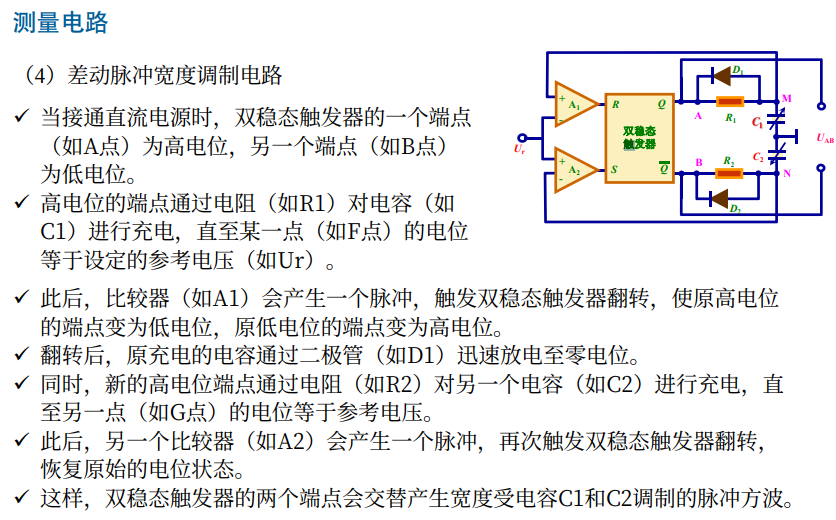

# 电阻式传感器

## 电阻式传感器的优点

- 测量灵敏度和精度高：在常温时精度可达 0.01% 左右
- 测量范围广：测量范围为 $10^{-4}$ ~ $2×10^5$ 量级的微应变
- 频率响应好：可以测量从静态到数十万赫的动态应变
- 应变片尺寸小，重量轻：最小的应变片栅长可短到 0.178mm
- 可在各种复杂环境下测量：如高、低温、高速旋转、强磁场等环境测量

## 电阻式传感器的组成

- 被测量 (压力、加速度)
- 敏感元件 (弹性梁、薄膜)
- 转换元件 (应变片)
- 测量电路 (电桥电路)

## 基本原理

应变效应

应变是描述**物体形变程度**的物理量，通常用来衡量物体在受到外部力作用下的变形程度

金属材料通常具有同质 (Homogeneous)、等向 (Isotropic) 的特性

### 金属应变效应

**金属（导体）**在外力作用下发生机械变形时，其**电阻值**随着所受机械变形（伸长或缩短）的变化而发生变化的现象

### 压阻效应

压阻效应（Piezoresistive effect）：**半导体材料**受到外力作用时，其**电阻率**发生变化的现象

### 总的公式

#### 轴向应变

根据材料力学，电阻丝的轴向应变为：
$$
\varepsilon = \frac{\Delta L}{L}
$$

#### 径向应变

根据材料力学，电阻丝的径向应变为：
$$
\frac{dr}{r} = -\mu \frac{dL}{L} = -\mu \varepsilon
$$

其中：
- $\mu$ 为导体材料的泊松系数

#### 截面积的变化

由截面积公式 $S = \pi r^2$ ，可以得到：

$$
\frac{dS}{S} = 2 \frac{dr}{r} = -2 \mu \varepsilon
$$

#### 整理可得

$$
\frac{dR}{R} = (1 + 2\mu)\varepsilon + \frac{d\rho}{\rho}
$$

### 结构与特性 (灵敏度)

金属材料的电阻率相对变化正比于体积的相对变化 (1)

$$
\frac{d\rho}{\rho} = C \frac{dV}{V} = C \frac{d(LS)}{LS} = C\left(\frac{dL}{L} - 2\mu \frac{dL}{L}\right) = C(1 - 2\mu)\varepsilon
$$

- $C$ 为由材料及加工方式决定的与金属导体晶格结构相关的比例系数

$$
\frac{dR}{R} = [(1 + 2\mu) + C(1 - 2\mu)]\varepsilon = K_m \varepsilon
$$

半导体材料的压阻效应 (2)

$$
\frac{d\rho}{\rho} = \pi \sigma = \pi E \varepsilon
$$

- $\pi$ 为半导体在受力方向的压阻系数
- $\sigma$ 为作用域材料上的轴向应力
- $E$ 为半导体材料的弹性模量

$$
\frac{dR}{R} = [(1 + 2\mu) + \pi E]\varepsilon = K_s \varepsilon
$$

#### 电阻丝的灵敏度系数 $K_m$（或者 $K_s$）

表示单位应变所引起的电阻相对变化

$$
K_{m/s} = \frac{\frac{dR}{R}}{\varepsilon}
$$

#### 电阻应变片的灵敏度系数 $K$

称为**标定灵敏度系数**，一般由实验测定。要求：
1. 弹性元件（试件材料）为泊松系数 $0.285$ 的钢材
2. 试件单向受力
3. 应变片轴向与主应力方向一致

**应变片由于传递失真、横向效应等原因**一般来说，$K < K_{m/s}$

### 结构与特性 (横向效应)

1. **基底**：固定敏感栅，绝缘、薄、挠性好
2. **敏感栅**：金属丝绕成栅状，感受应变的变化大小
3. **覆盖层**：防潮、防蚀、防损等
4. **引线**：连接敏感栅和测量电路

- 应变片的纵向应与测量的形变方向一致
- 圆弧部分产生负的电阻变化**降低了应变片的灵敏度**
- 必须采取措施**减小横向效应**的影响

### 结构与特性 (温度误差)

应变片产生温度误差的主要原因：

应变片电阻丝的电阻变化：( $\alpha_t$ - 温度系数,  $t$ - 温度)

$$
\Delta R_{t\alpha} = \alpha_t R_0 \Delta t
$$

弹性元件（试件材料）和应变片材料的线膨胀系数不同使应变片电阻丝产生附加拉长（或压缩）：( $K$ - 应变片灵敏度系数， $\beta$ - 线膨胀系数)

$$
\Delta R_{t\beta} = R_0 K (\beta_{\text{弹}} - \beta_{\text{应}}) \Delta t
$$

#### 温度变化 $\Delta t$ 形成的总应变变化

$$
\varepsilon_{\Delta t} = \left( \frac{\Delta R_t}{R_0} \middle/ K \right)
= \frac{\alpha_t}{K} \Delta t + (\beta_{\text{弹}} - \beta_{\text{应}}) \Delta t
$$

注：
- **温度系数** 指材料温度每升高一度时，电阻增大的百分数。
- **线膨胀系数** 指固体物质的温度每升高 $1^\circ C$ 时，其单位长度的伸长量

### 测量电路

通常利用直流电桥检测电路将电阻变化量转换成电压变化

---

#### 直流电桥的特性方程

$$
U_o = U \left( \frac{R_1}{R_1 + R_2} - \frac{R_3}{R_3 + R_4} \right)
$$

---

#### 当电桥平衡时，可以得到

$$
\frac{R_1}{R_2} = \frac{R_3}{R_4}
$$

---

#### 等臂电桥

当所有电阻初始值为 $R_1 = R_2 = R_3 = R_4 = R$ 时，称为**等臂电桥**

---

#### 电桥灵敏度

**电桥灵敏度**指电桥测量臂的单位相对变化量导致输出端电压的变化：

$$
K_u = \frac{U_o}{\Delta R / R}
$$

当一个桥臂接入应变片时 - **单臂电桥**：

$$
U_o \approx \frac{U}{4} \cdot \frac{\Delta R}{R} = \frac{U}{4} K \varepsilon
$$

电桥灵敏度是：

$$ \frac{U}{4} $$

---

当两个桥臂接入应变片时 - **双臂电桥**：

$$
U_o \approx \frac{U}{4} \left( \frac{\Delta R_1}{R} - \frac{\Delta R_2}{R} \right)
= \frac{U}{2} \frac{\Delta R}{R} = \frac{U}{2} K \varepsilon
$$

电桥灵敏度是：

$$ \frac{U}{2} $$

还可以直接对温度进行补偿

---

当四个桥臂接入应变片时 - **全桥电路**

$$
U_o = \frac{U \left( 2R \Delta R - 2R \Delta R \right)}{4R^2}
= U \frac{\Delta R}{R} = U K \varepsilon
$$

---

电桥灵敏度:

$$
K_u : \text{电桥灵敏度} \quad K_u = U
$$

---

**注：** 全桥电路可以提高电桥的灵敏度，消除电桥的非线性，实现温度补偿

# 电容式传感器

## 基本原理

### (1) 平板电容器

平板电容器的电容计算公式为：

$$
C = \frac{\varepsilon_0 \varepsilon_r A}{\delta}
$$

其中：
- **C** —— 电容量，单位：F（法拉）；
- $\varepsilon_0$ —— 真空介电常数，\(8.85 \times 10^{-12} \, \text{F/m}\)；
- $\varepsilon_r$ —— 极板间介质的相对介电常数；
- **A** —— 极板的有效面积（单位：\(\text{m}^2\)）；
- $\delta$  —— 两平行极板间的距离（单位：m）

### （2）圆筒电容器

公式表示:

$$
C = \frac{2 \pi \varepsilon_0 \varepsilon_r l}{\ln \frac{R}{x}}
$$

其中:
- **\( C \)**: 电容量，单位：法拉（\( F \)）；
- **\( \varepsilon_0 \)**: 真空介电常数，\( 8.85 \times 10^{-12} \, F/m \)；
- **\( \varepsilon_r \)**: 极板间介质的相对介电常数；
- **\( R \)**: 定极筒的半径（\( m \)）；
- **\( x \)**: 动极筒的半径（\( m \)）；
- **\( l \)**: 定极筒和动极筒的重合长度（\( m \)）。

## 传感器类型与特性

### （1）变极距型电容传感器

#### 电容变化量公式

电容变化量公式如下：

$$
\Delta C = C_0 \frac{\Delta d / d_0}{1 - \Delta d / d_0} = C_0 \frac{\Delta d}{d_0 - \Delta d}
$$

当量程远小于极板间初始距离时：

$$
\Delta C \approx C_0 \frac{\Delta d}{d_0}
\quad \text{且} \quad \Delta d / d_0 \ll 1
$$

#### 电容相对变化量与极板间距变化呈线性关系

灵敏度为：

$$
K_d = \frac{\Delta C}{\Delta d} \approx \frac{C_0}{d_0}
$$

### （2）线位移变面积型电容传感器

#### 电容变化量公式

平行板式电容器的电容变化量为：

$$
\Delta C = -\frac{\varepsilon_0 \varepsilon_r b \Delta l}{d}
$$

#### 电容变化位移灵敏度

电容变化位移灵敏度为：

$$
K_A = \frac{\Delta C}{\Delta l} = -\frac{\varepsilon_0 \varepsilon_r b}{d}
$$

---

平行板式电容传感器的电容变化量只是与极板移动位置有关。在结构参数固定的情况下，灵敏度与板间初始距离 \( d \) 有关。

### （3）角位移变面积型电容传感器

#### 电容变化量公式

角位移面积型电容传感器的电容变化量为：

$$
\Delta C = -C_0 \frac{\Delta \theta}{\Pi}
$$

#### 电容变化角位移灵敏度

电容变化角位移灵敏度为：

$$
K_A = \frac{\Delta C}{\Delta \theta} = -C_0 \frac{1}{\Pi}
$$

---

角位移面积型电容传感器的电容变化量与输入量（角位移）呈线性关系，如图示动态极板与定片的角位移构成示意图。

### （4）筒状线位移变面积型传感器

### 电容变化量公式

电容变化量为：

$$
\Delta C = -C_0 \frac{\Delta x}{l} = -\frac{2 \pi \varepsilon_0 \varepsilon_r \Delta x}{\ln(R / r)}
$$

### 电容变化位移灵敏度

电容变化位移灵敏度为：

$$
K_A = \frac{\Delta C}{\Delta x} = -C_0 \frac{1}{l} = -\frac{2 \pi \varepsilon_0 \varepsilon_r}{\ln(R / r)}
$$

---

电容变化量只与极板移动位置有关，呈线性关系。电容变化灵敏度与内外筒半径 \( R \) 和 \( r \) 有关

### （5）变介质型电容式传感器

### 电容计算公式

#### 介质插入后，可视作电容器串联

$$
\frac{1}{C_A} = \frac{1}{C_{A1}} + \frac{1}{C_{A2}}
= \frac{1}{\left(\frac{\varepsilon_1 A}{d_1}\right)} + \frac{1}{\left(\frac{\varepsilon_2 A}{d_2}\right)}
= \frac{1}{\left(\frac{\varepsilon_1 b l_1}{d_1}\right)} + \frac{1}{\left(\frac{\varepsilon_2 b l_1}{d_2}\right)}
$$

#### 左右两部分，可视作电容器并联

$$
C = C_A + C_B
= \frac{b l_1}{\frac{d_1}{\varepsilon_1} + \frac{d_2}{\varepsilon_2}}
+ \frac{b (l_0 - l_1)}{\frac{d_1 + d_2}{\varepsilon_1}}
$$

#### 已知初始电容值

$$
C_0 = \frac{\varepsilon_1 b l_0}{d_1 + d_1}
$$

#### 整理后，可得电容量关系

$$
C = C_0 + C_0 \frac{l_1}{l_0} \left( 1 - \frac{\varepsilon_1}{\varepsilon_2} \right) \frac{\frac{d_1}{d_2}}{\frac{d_1}{d_2} + \frac{\varepsilon_1}{\varepsilon_2}}
$$

---

极板厚度以及极板的介电常数都固定以后，该传感器的电容增量与插入板的长度成线性关系

## 测量电路

- 单个电容量变化的测量，可以用调频电路、运算放大器来实现
- 差动电容量变化的测量可以用**交流电桥、差动脉冲宽度调制**电路等实现

### 调频电路

#### 当有被测信号时，振荡器频率变化

若有电容变化量 \( \Delta C \neq 0 \)，振荡器的频率会有一个相应的改变量 \( \Delta f \)。改变后的频率为：

$$
f' = \frac{1}{2 \pi \sqrt{L (C_0 + \Delta C)}} = f_0 \pm \Delta f
$$

其中，振荡器的基础频率为：

$$
f = \frac{1}{2 \pi \sqrt{L C}}
$$

#### 系统框图

- 调频振荡器 (包含电容式传感器)
- 经过改变量 \( \Delta f \) 的频率变化
- 经由限幅电路、鉴频电路，输出信号的变化 \( \Delta u \)
- 最终由放大电路输出

### 运算放大器

#### 运算放大器特性与计算公式

运算放大器具有 **放大倍数大** 和 **输入阻抗高** 的特点。
\( C_x \) 表示传感器电容，O 点为 "虚地"。
由于运算放大器放大倍数较大且输入阻抗较高，假设它们为无穷大时，有以下关系：

$$
\dot{U}_0 = -\frac{C_0}{C_x} \dot{U}_i
$$

其中：

- $C_x$ 为传感器电容
- $U_i$ 为输入电压
- $U_0$ 为输出电压

---

#### 如果传感器是变距离型平板电容器

电容表达式为：

$$
C_x = \frac{\varepsilon_0 \varepsilon_r A}{d}
$$

代入上式，有：

$$
\dot{U}_0 = -\dot{U}_i \cdot \frac{C_0}{\varepsilon_0 \varepsilon_r A} \cdot d
$$

---

因此，输出电压 \( \dot{U}_0 \) 与板间距离 \( d \) 呈线性关系。

### (3) 交流电桥

电桥输出电压 \( \dot{U}_0 \)：

$$
\dot{U}_0 = \dot{E} \frac{Z_2 - Z_1}{Z_2 + Z_1}
$$

---

### 电容和阻抗关系

#### 电容表达式:

  \( C_1 = \frac{\varepsilon A}{d_0 - \Delta d} \)
- \( C_2 = \frac{\varepsilon A}{d_0 + \Delta d} \)

#### 阻抗表达式:

- \( Z_1 = \frac{1}{j \omega C_1} = \frac{d_0 - \Delta d}{j \omega \varepsilon A} \)
- \( Z_2 = \frac{1}{j \omega C_2} = \frac{d_0 + \Delta d}{j \omega \varepsilon A} \)

---

### 代入结果

将 \( Z_1 \) 和 \( Z_2 \) 代入 \( \dot{U}_0 \) 的表达式，整理得：

$$
\dot{U}_0 = \dot{E} \frac{\Delta d}{d_0}
$$

---

### 结论

交流电桥的输出电压 \( \dot{U}_0 \) 与位移变化量 \( \Delta d \) 成正比，比例系数与平板间的初始距离 \( d_0 \) 有关。

### 差动脉冲宽度调制电路

RS 触发器的逻辑功能可以通过以下方程描述

- 当 R=1 且 S=0 时，Q=0，Q'=1（复位）
- 当 R=0 且 S=1 时，Q=1，Q'=0（置位）
- 当 R=0 且 S=0 时，Q 和 Q'保持不变（保持）---这个就是初始状态
- 当 R=1 且 S=1 时，Q 和 Q'状态不确定（禁止）

# 电感式传感器

电感传感器是将被测量转换为线圈的**自感或互感**的变化来测量的装置。

## 基本原理

### （1）自感式传感器

---

传感器一般由线圈、铁芯、衔铁三部分组成。

线圈中电感量定义为：

$$
L = \frac{\psi}{I} = \frac{N\phi}{I}
$$

其中：
- $L$——线圈电感量
- $\psi$——线圈磁链
- $\phi$——穿过线圈的磁通
- $I$——通过线圈的电流
- $N$——线圈匝数

由磁路欧姆定律知：

$$
\phi = \frac{IN}{R_m}
$$

其中：
- $R_m$——总磁阻

综合可得：

$$
L = \frac{N^2}{R_m}
$$

---

#### 磁阻

$$
R_m = R_1 + R_2 + R_6 = \frac{l_1}{\mu_1 A_1} + \frac{l_2}{\mu_2 A_2} + \frac{2\delta_0}{\mu_0 A_0}
$$

其中：
- $\mu_0, \mu_1, \mu_2$——空气、铁芯、衔铁的磁导率，单位：H/m；
- $A_0, A_1, A_2$——气隙、铁芯、衔铁的截面积；
- $l_1, l_2$——磁通通过铁芯和衔铁中中心线的长度；
- $\delta_0$——气隙的厚度。

由于 $R_1 + R_2 \ll R_6$，磁阻可近似为：

$$
R_m \approx R_6 = \frac{2\delta_0}{\mu_0 A_0}
$$

于是可得：

$$
L_0 \approx \frac{N^2}{R_6} = \frac{\mu_0 A_0 N^2}{2\delta_0}
$$

---

#### 变气隙型

衔铁上移 $\Delta \delta$：

$$
\delta = \delta_0 - \Delta \delta
$$

$$
\Delta L_2 = L_2 - L_0 = \frac{\mu_0 A_0 N^2}{2 (\delta_0 - \Delta \delta)} - \frac{\mu_0 A_0 N^2}{2 \delta_0} = L_0 \frac{\Delta \delta}{\delta_0 - \Delta \delta}
$$

当 $\frac{\Delta \delta}{\delta_0} \ll 1$ 时：

$$
\frac{\Delta L_2}{L_0} = \frac{\Delta \delta}{\delta_0} + \left(\frac{\Delta \delta}{\delta_0}\right)^2 + \left(\frac{\Delta \delta}{\delta_0}\right)^3 + \dots
$$

忽略高次项：

$$
\Delta L_2 \approx \frac{L_0}{\delta_0} \Delta \delta
$$

灵敏度近似为：

$$
K = \left|\frac{\Delta L_2}{\Delta \delta}\right| \approx \frac{L_0}{\delta_0}
$$

灵敏度取决于气隙的初始厚度，自感式传感器主要用于测量微小位移。
动态测量范围：$0.001 \sim 1 \ \mathrm{mm}$。

---

#### 差动结构

当衔铁下移时，导致上、下线圈的电感值发生变化，分别为：

$$
L_1 = \frac{\mu_0 A_0 N^2}{2 (\delta_0 + \Delta \delta)}
$$

$$
L_2 = \frac{\mu_0 A_0 N^2}{2 (\delta_0 - \Delta \delta)}
$$

展开为：

$$
L_1 = L_0 \left[1 - \frac{\Delta \delta}{\delta_0} + \left(\frac{\Delta \delta}{\delta_0}\right)^2 - \left(\frac{\Delta \delta}{\delta_0}\right)^3 + \dots\right]
$$

$$
L_2 = L_0 \left[1 + \frac{\Delta \delta}{\delta_0} + \left(\frac{\Delta \delta}{\delta_0}\right)^2 + \left(\frac{\Delta \delta}{\delta_0}\right)^3 + \dots\right]
$$

电感差值：

$$
\Delta L = L_2 - L_1 = 2 L_0 \left[\frac{\Delta \delta}{\delta_0} + \left(\frac{\Delta \delta}{\delta_0}\right)^3 + \left(\frac{\Delta \delta}{\delta_0}\right)^5 + \dots\right]
$$

忽略高次项：

$$
\Delta L \approx 2 \frac{L_0}{\delta_0} \Delta \delta
$$

灵敏度近似为：

$$
K = \left|\frac{\Delta L}{\Delta \delta}\right| \approx 2 \frac{L_0}{\delta_0}
$$

灵敏度**提高一倍**

---

#### 其他结构

- 变气隙型
  - 灵敏度高、对后续测量电路的放大倍数要求低
  - 缺点是非线性严重、示值范围较小、衔铁运动受铁芯限制导致的自由行程较小
- 变截面型
  - 具有较好的线性、自由行程较大、制造装配比较方便、批量生产中的互换性较好
  - 缺点是较大空气隙使磁路的磁阻高、灵敏度低。
- 螺管型
  - 优点是自由行程可任意安排、线性范围大、结构简单、制造装配容易方便、互换性好。

### (2) 互感式传感器

第一只线圈中电流所产生的磁通有一部分与第二只线圈相环链

当第一线圈中电流发生变化时，则其与第二只线圈环链的磁通也发生变化，在第二只线圈中产生感应电动势。这种现象叫做**互感现象**
